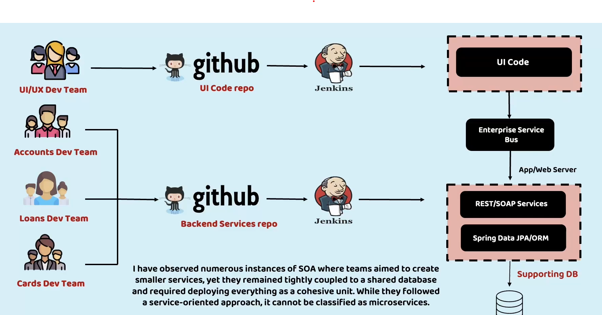
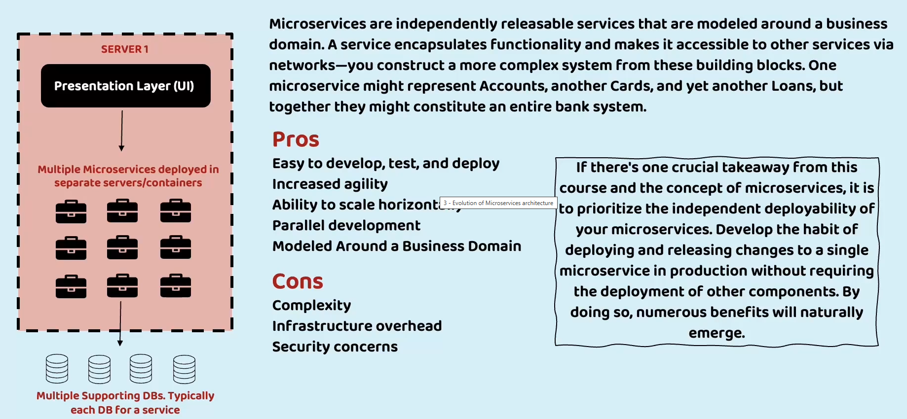
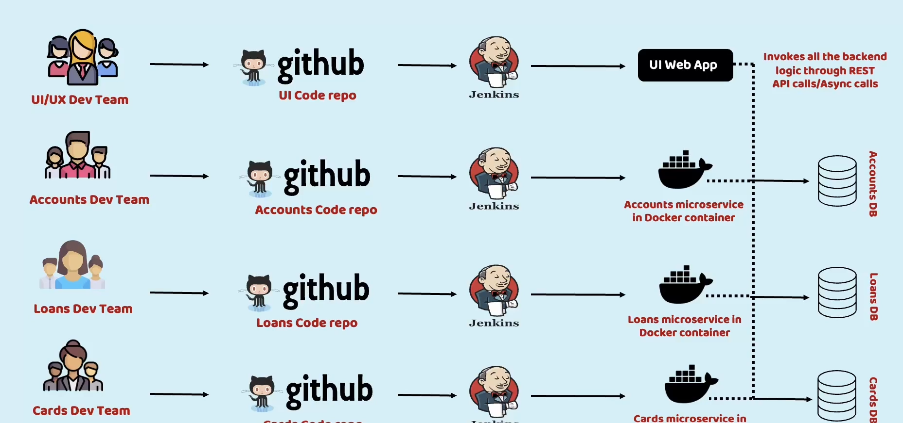
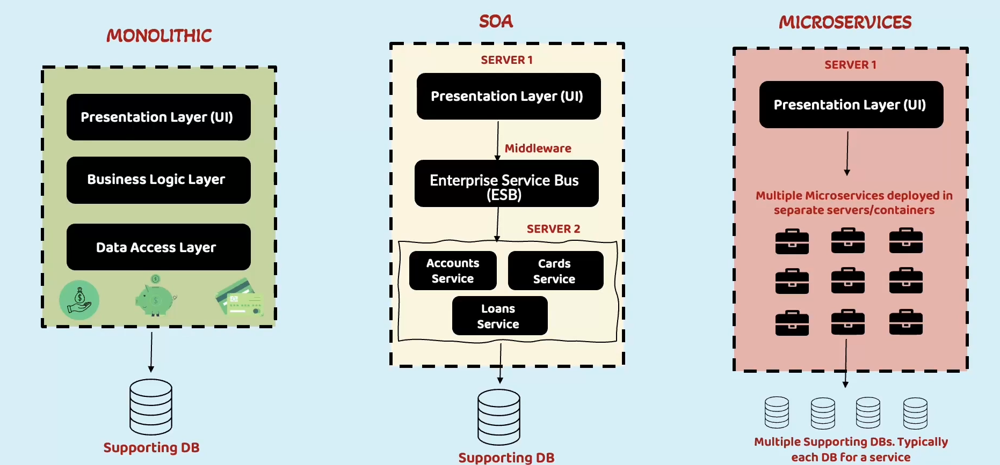
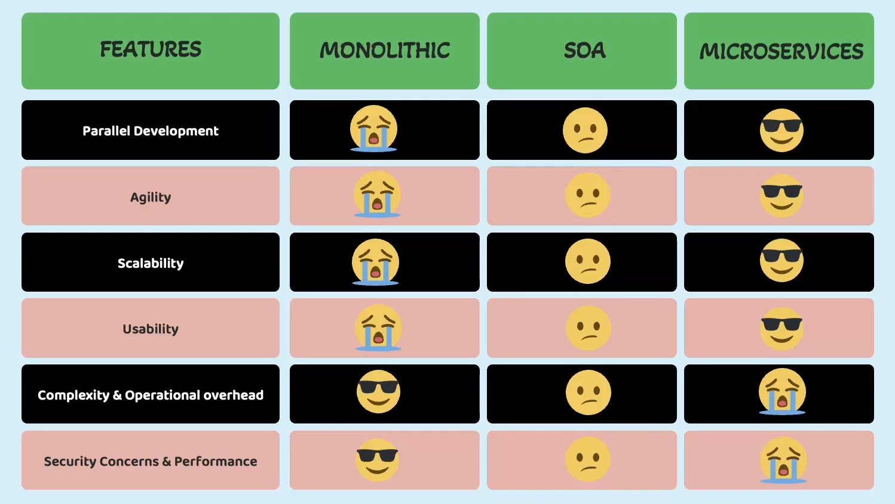

# master-micro-service

## Monolith
Monolithic architecture have 3 forms 
1. Singular Monolith
2. Distributed Monolith
3. Third-party Monolith

More : <a href="https://www.codurance.com/publications/types-of-monolith-coupling">Visit Here</a>

1. Singular Monolith : A Singular Monolith is a traditional monolithic architecture in which an entire 
application is built as a single, self-contained unit. All components, such as the frontend, backend, 
and database, are tightly integrated, making it difficult to change or scale individual parts.

2. Distributed Monolith : A Distributed Monolith is an architecture where individual components are physically 
separated and communicate via network protocols, but they still exhibit tight coupling and maintain 
dependencies on each other.

3. Third-party Monolith : Third-party Monoliths are primarily affected by deployment coupling, 
as the system's reliance on external components can limit the ability to make changes and deploy new features.

## SOA (Service Oriented Architecture)

## Micro Service

## Monolithic vs SOA vs Micro Service

## Definition of Micro Service
`Microservice is an approach to developing a single application as a suit of small services, each running 
in its own process and communicating with lightweight mechanisms, built around business capabilities and 
independently deployable by fully automated deployment machinery.`

Resources :
<a href="https://github.com/eazybytes/microservices">Visit Here</a>